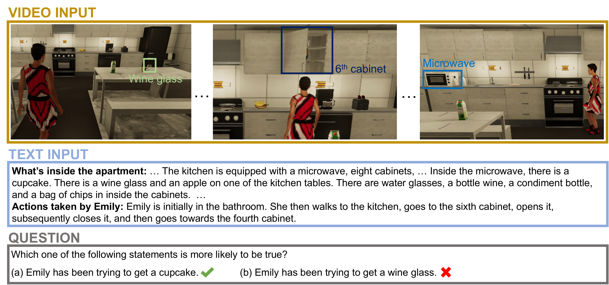

## MMToM-QA: Multimodal Theory of Mind Question Answering <br> <sub>Official Model Implementation and Benchmark Guidelines</sub>

### [Paper](https://arxiv.org/abs/2401.08743) | [Project Page](https://chuanyangjin.com/mmtom-qa) | [Twitter](https://x.com/MIT_CSAIL/status/1750925830937604386)



This repo features the code for the paper [**MMToM-QA: Multimodal Theory of Mind Question Answering**](https://arxiv.org/abs/2401.08743).

It contains:

* 🪐 The implementation of our method, BIP-ALM.
* 💥 Guidelines for utilizing the MMToM-QA benchmark.

## Bayesian Inverse Planning Accelerated by Language Models (BIP-ALM)

We propose Bayesian Inverse Planning Accelerated by Language Models (BIP-ALM), a novel method to engineer multimodal Theory of Mind. Here is an [overview](visuals/model.png) of the method.

To extract symbolic representations from videos:

```bash
python visual_perception.py --benchmark_video_path videos
```

To extract symbolic representations from text and fuse them with video-derived representations, creating a unified depiction of the event and the physical scene:

```bash
python text_parsing.py --type multimodal --benchmark_path questions.json --output_file multimodal_representations.json
```

To conduct inverse inference about the agent's goal and belief using (finetuned) language models (taking LLaMA 2 as an example):

```bash
python inverse_symbolic_planner.py --data_path multimodal_representations.json --model_name_or_path meta-llama/Llama-2-7b-hf --load_lora 1 --lora_name_or_path output/checkpoint-llama --output_path output.txt
```

To finetune the language model (optional):

```bash
python generate_finetuning_dataset.py --data_path finetuning_data --output_file formatted_finetuning_data.json
```

```bash
python finetuning.py --train_file formatted_finetuning_data.json --model_name_or_path meta-llama/Llama-2-7b-hf --fisher_matrix_path fisher-matrix/fisher-matrix-6B --per_device_train_batch_size 4 --gradient_accumulation_steps 4 --lr 5e-5 --num_epochs 3 --ewc_lambda 0.5 --output_dir output_finetuning.txt
```

## MMToM-QA Benchmark

MMToM-QA is the first multimodal benchmark to evaluate machine Theory of Mind (ToM), the ability to understand people's minds. For a detailed description, please visit our [project page](https://chuanyangjin.com/mmtom-qa).

### Datasets

#### Text-only version
[Text Inputs & Questions](/Benchmark/questions.json) (1.1 MB)

#### Multimodal version
[Text Inputs & Questions](/Benchmark/questions.json) (1.1 MB)

[Video Inputs](http://virtual-home.org/release/MMToMQA/benchmark.zip) (257 GB)

### Usage

#### Text-only version
To use the text-only version of MMToM-QA, you require the file [questions.json](/Benchmark/questions.json). This file comprises 600 entries, each corresponding to one of the 600 questions. Every entry is formatted as a Python dictionary, with a key labeled "question" for the question itself, and another key named "answer" that contains the correct response, either “a” or “b”. The "question_type" key can be used to assess the accuracy for each question subtype.

Example of testing GPT-4:
```bash
python testing_gpt.py --gpt_choice gpt-4
```

#### Multimodal version
To use the multimodal version of MMToM-QA, you also need the relevant videos for each question. Each entry includes a key named “episode” to identify the corresponding video for that question. Additionally, there's a key called "end_time" that indicates the necessity of only considering the steps before this specified end time.

In the [videos](http://virtual-home.org/release/MMToMQA/benchmark.zip), you'll find 134 videos, each labeled with an "episode number." The file "task_{episode}/frame_intervals.pik" details the start and end frames for each step. By referring to the "end time", you can determine the required "end frame" for a particular video. The frames within a video are found in "task_{episode}/script/0/Action_{frame_number:04d}_0_normal.png". These frames can be used entirely or selectively sampled. Additionally, we offer various other [data types](visuals/available_data_type.png) (e.g., "depth.exr", "seg_inst.png") in the same path for your reference.

Example of testing GPT-4V:
```bash
python testing_gpt.py --gpt_choice gpt-4v
```

#### Video-only version
To use the video-only version, follow a process similar to the multimodal version, but omit certain elements in the "questions". Exclude the sections "What's inside the apartment: ..." and "Actions taken by the person: ...", focusing solely on the questions.

Example of testing GPT-4V:
```bash
python testing_gpt.py --gpt_choice gpt-4v --video_only
```

Note: There is both overlap and complementarity in the information presented in the text and videos, as demonstrated in the [example](visuals/intro.png). From a video, a model gets the dynamic state change at each step as well as what objects the agent is walking towards and is passing by at a given step. A model needs this information to determine the agent’s expected action plans given a hypothesis about the belief and the goal. From the text, a model gets ground truth information about the initial state. Because of the partial observations caused by the limited camera view and occlusion, the text provides additional state information that is sometimes unavailable in the video. A model requires information about the true world state to determine whether an agent has a true belief or false belief as well as what objects the agent has observed so far.

## Citations
Please cite the paper and star this repo if you find it interesting/useful, thanks!

```bibtex
@article{jin2024mmtom,
  title={Mmtom-qa: Multimodal theory of mind question answering},
  author={Jin, Chuanyang and Wu, Yutong and Cao, Jing and Xiang, Jiannan and Kuo, Yen-Ling and Hu, Zhiting and Ullman, Tomer and Torralba, Antonio and Tenenbaum, Joshua B and Shu, Tianmin},
  journal={arXiv preprint arXiv:2401.08743},
  year={2024}
}
```
